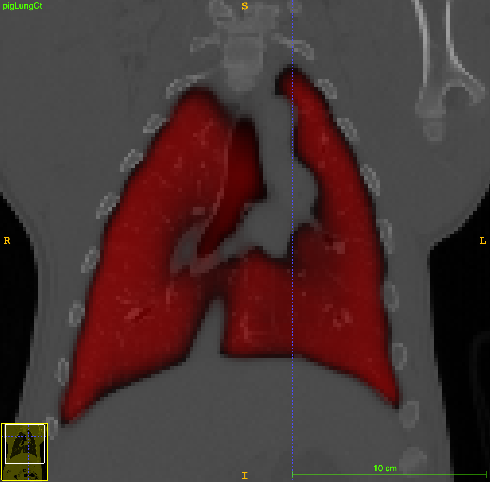

# App:  Pig lung CT segmentation

Deep learning app made for pig lung CT segmentation using ANTsRNet/ANTsPyNet

## Citation

* __Nicholas J. Tustison__, Brian B. Avants, Zixuan Lin, Xue Feng, Nicholas Cullen, Jaime F. Mata, Lucia Flors, James C. Gee, Talissa A. Altes, John P. Mugler III, and Kun Qing.  Convolutional Neural Networks with Template-Based Data Augmentation for Functional Lung Image Quantification, _Academic Radiology_. [(pubmed)](https://www.ncbi.nlm.nih.gov/pubmed/30195415)

## Model training notes

* Training data: 80 pig lung CT images
* Unet model (see ``Scripts/Training/``).
* Template-based data augmentation

## Sample usage

```
#
#  Python usage:
#    python doLungExtraction.py inputImage outputImage reorientationTemplate
#

$ python3 doLungExtraction.py /Users/ntustison/Pkg/ANTsRNetApps/PigLungSegmentation/Data/Example/pigLungCt.nii.gz /Users/ntustison/Pkg/ANTsRNetApps/PigLungSegmentation/Data/Example/pigLungCtMask_antspynet.nii.gz /Users/ntustison/Pkg/ANTsRNetApps/PigLungSegmentation/Data/Template/T_template0_resampled.nii.gz
Using TensorFlow backend.

Reading reorientation template /Users/ntustison/Pkg/ANTsRNetApps/PigLungSegmentation/Data/Template/T_template0_resampled.nii.gz
  (elapsed time:  0.060254812240600586  seconds)
WARNING:tensorflow:From /Users/ntustison/anaconda3/lib/python3.6/site-packages/tensorflow/python/framework/op_def_library.py:263: colocate_with (from tensorflow.python.framework.ops) is deprecated and will be removed in a future version.
Instructions for updating:
Colocations handled automatically by placer.
Loading weights file
2019-07-01 12:33:13.334052: I tensorflow/core/platform/cpu_feature_guard.cc:141] Your CPU supports instructions that this TensorFlow binary was not compiled to use: AVX2 FMA
  (elapsed time:  0.31043100357055664  seconds)
Reading  /Users/ntustison/Pkg/ANTsRNetApps/PigLungSegmentation/Data/Example/pigLungCt.nii.gz
  (elapsed time:  0.21217799186706543  seconds)
Normalizing to template
  (elapsed time:  0.29094386100769043  seconds)
Prediction and decoding
  (elapsed time:  6.969862937927246  seconds)
Renormalize to native space
  (elapsed time:  0.12820005416870117  seconds)
Writing /Users/ntustison/Pkg/ANTsRNetApps/PigLungSegmentation/Data/Example/pigLungCtMask_antspynet.nii.gz
  (elapsed time:  0.20627188682556152  seconds)
Total elapsed time:  7.80769681930542 seconds
```

```
#
#  R usage:
#    Rscript doLungExtraction.R inputImage outputImage reorientationTemplate
#

$ Rscript doLungExtraction.R /Users/ntustison/Pkg/ANTsRNetApps/PigLungSegmentation/Data/Example/pigLungCt.nii.gz /Users/ntustison/Pkg/ANTsRNetApps/PigLungSegmentation/Data/Example/pigLungCtMask_anstrnet.nii.gz /Users/ntustison/Pkg/ANTsRNetApps/PigLungSegmentation/Data/Template/T_template0_resampled.nii.gz

*** Successfully loaded .Rprofile ***

Loading required package: ANTsRCore

Attaching package: ‘ANTsRCore’

The following object is masked from ‘package:stats’:

    var

The following objects are masked from ‘package:base’:

    all, any, apply, max, min, prod, range, sum

Reading reorientation template /Users/ntustison/Pkg/ANTsRNetApps/PigLungSegmentation/Data/Template/T_template0_resampled.nii.gz  (elapsed time: 0.05901098 seconds)
Using TensorFlow backend.
WARNING:tensorflow:From /Users/ntustison/anaconda3/envs/r-tensorflow/lib/python3.6/site-packages/tensorflow/python/framework/op_def_library.py:263: colocate_with (from tensorflow.python.framework.ops) is deprecated and will be removed in a future version.
Instructions for updating:
Colocations handled automatically by placer.
Loading weights file2019-07-01 12:30:23.446388: I tensorflow/core/platform/cpu_feature_guard.cc:141] Your CPU supports instructions that this TensorFlow binary was not compiled to use: AVX2 FMA
  (elapsed time: 0.263989 seconds)
Reading  /Users/ntustison/Pkg/ANTsRNetApps/PigLungSegmentation/Data/Example/pigLungCt.nii.gz  (elapsed time: 0.545331 seconds)
Normalizing to template  (elapsed time: 0.2350981 seconds)
Prediction and decoding (elapsed time: 6.856144 seconds)
Renormalize to native space  (elapsed time: 0.1048579 seconds)
Writing /Users/ntustison/Pkg/ANTsRNetApps/PigLungSegmentation/Data/Example/pigLungCtMask_antsrnet.nii.gz  (elapsed time: 0.198648 seconds)

Total elapsed time: 8.079521 seconds
```

## Sample results


